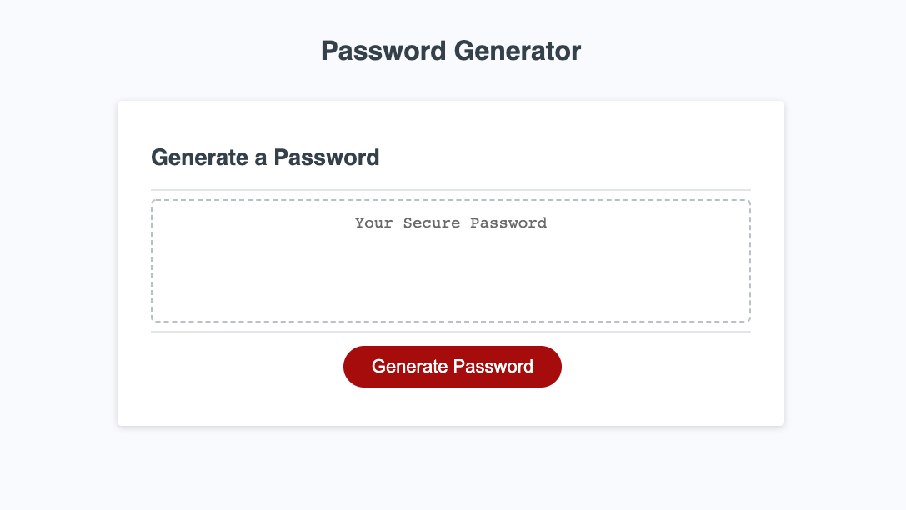

# PasswordGenerator

This application uses Javascript to generate a random, secure password for the user.

## *How to?*
Click the **Generate Password** button to start. Enter the desired length of the password in the promptv(min is 8 and max is 128). If you click **Cancel** the execution will stop. To start again, click the **Generate Password** button.

Then, confirm whether you would like to include lowercase letters, uppercase letters, numbers, and special characters. After the last prompt, the password will appear in the text area.

[Deployed web page](https://vasylynash.github.io/PasswordGenerator/)

